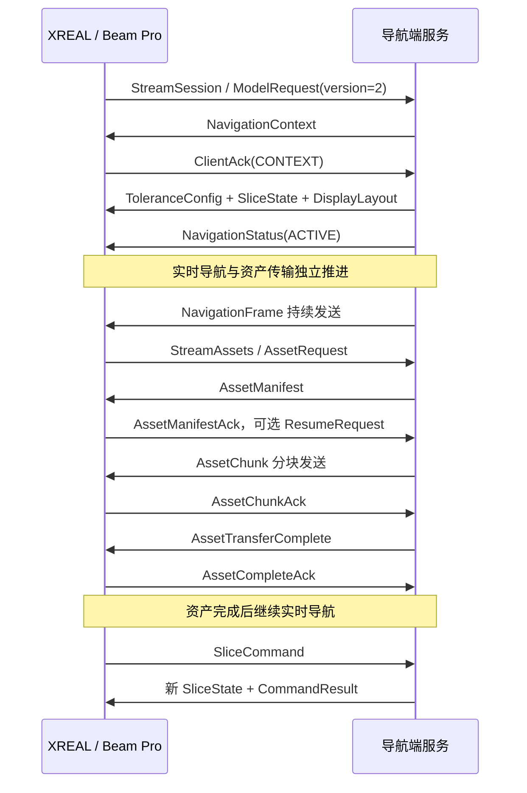

# 手术机器人导航端对接 XREAL 开发指南

日期：2026-09-18

面向：手术机器人导航软件、通信服务、影像与联调开发人员

依据：First XR 当前工作区的协议与客户端源码

**导航端需要实现一个 gRPC 服务，将导航系统计算出的实时指标、病例/规划上下文、完整 DICOM 和 STL 发送给 Beam Pro 上的 XREAL 客户端；同时接收眼镜切片操作、控制执行结果和可选观察视频。导航端是数据与控制状态的权威来源。**

本文区分三类信息：**现有实现**表示已在当前协议或源码中核对；**开发要求**表示导航端应实现的接入行为；**建议/待确认**表示尚未成为双方已验证的约定。本文的源码检查与模拟器检查不代表真实机器人、Beam Pro 或临床验证。

交接时请同时提供本文件和同版本的 [dental_model_transfer.proto](../dental_model_transfer.proto)。协议字段名、字段号、类型和枚举以该文件为准，不另建一份不一致的消息定义。本次核对的协议 SHA-256：

```text
527cf36ab17bebca9fe897e46c3e18e4c46fd93924b870f59d396f67c52cfeea
```

## 1. 双方分别开发什么

| 能力 | 导航端负责 | XREAL / Beam Pro 当前职责 |
|---|---|---|
| 病例与规划 | 确定病例、CT、牙位、规划、钻针、步骤及版本 | 依据当前上下文展示，过滤旧版本 |
| 实时导航 | 计算钻尖、钻轴、偏移、角度和深度；判断追踪是否有效 | 展示数值、方向、颜色与数据时效 |
| 坐标与配准 | 统一导航空间、DICOM 空间及模型空间；提供变换 | 按下发的坐标与变换采样、显示 |
| 阈值 | 提供经项目确认的阈值、边界规则及滞回 | 使用收到的配置；缺失时提示“阈值未同步” |
| CT 与模型 | 提供完整 DICOM 序列、teeth/drill STL、清单及校验 | 接收、校验、建体、切片与模型渲染 |
| 切片同步 | 维护同步开关、两个显示端的切片状态；仲裁冲突 | 发送切片请求，应用导航端返回的状态 |
| 显示控制 | 控制 HUD/模型位置、显隐及恢复默认 | 应用布局并回报实际应用结果 |
| 远端观察 | 按需请求 XR 镜像/RGB；实现媒体接收与解码 | 编码真实 XR 左眼画面及可选 RGB 画面 |

该协议没有机械臂运动、速度、力矩、钻机启停等命令。眼镜切片手势只进入显示控制模块；不要将其接到机器人运动控制接口。三维模型窗口目前是独立观察窗口，不能当成已经与真实牙齿配准的 AR 叠加。

## 2. 连接方式与服务接口

### 2.1 服务部署

- **导航工作站是 gRPC Server；Beam Pro 是 gRPC Client**，由 Beam Pro 主动发起连接。
- 当前默认地址是 `192.168.31.166:50051`，`device_id=beam-pro`、初始请求 `dataset_id=default`。地址可在 Beam Pro 的“连接”页修改。生产端应维护设备与病例的明确绑定，不能把 `default` 固定映射到任意患者数据。
- 当前客户端使用 `http://IP:port` 的 HTTP/2 明文 gRPC，未实现证书、Token 或设备认证交换。开发联调按这一现状配置；需要 TLS/设备认证的部署必须双方一起补齐，单改服务端会导致现有客户端无法连接。
- gRPC 服务端监听可被 Beam Pro 访问的网卡，放行相应 TCP 端口。视频接收端另放行约定 UDP 端口，当前接收示例使用 `5555`。
- 以下“双流”是两个独立 RPC，当前客户端共用一个 gRPC channel；独立业务流不代表独占网络带宽。

```proto
package dentalmodeltransfer;

service DentalModelTransfer {
  rpc StreamDentalModel(stream ClientMessage) returns (stream ServerMessage) {}
  rpc StreamSession(stream ClientMessage) returns (stream ServerMessage) {}
  rpc StreamAssets(stream AssetClientMessage) returns (stream AssetServerMessage) {}
}
```

此处仅展示接口签名，生成代码必须使用完整原始 `.proto`。

| RPC | 开发要求 | 结束条件 |
|---|---|---|
| `StreamSession` | 必须实现；导航、阈值、切片、布局、观察控制与反馈 | `SessionEnd` 或传输断开 |
| `StreamAssets` | 完整 CT / 模型功能必须实现；资产清单、分块、续传与校验 | 可长期保留，等待后续上下文的新请求 |
| `StreamDentalModel` | 仅用于兼容旧客户端/旧服务 | 不作为本次完整功能的交付入口 |

只有 `StreamSession` 返回 gRPC `UNIMPLEMENTED` 时，现有客户端才回退到 v1。资产 RPC 单独返回 `UNIMPLEMENTED` 时，导航流仍继续，但没有 v2 资产能力。

gRPC 双向流允许双方独立读写，并保留单条流内的消息顺序；不同 RPC 之间仍需依靠业务 ID 和版本关联。服务端应并行推进读取与发送，不能等客户端关闭请求流后才返回消息。[gRPC 官方说明](https://grpc.io/docs/what-is-grpc/core-concepts/)

### 2.2 信息交换总表

| 方向 | 消息 | 触发时机 |
|---|---|---|
| XREAL → 导航 | `ModelRequest` | 建立会话；协议版本为 2 |
| 导航 → XREAL | `NavigationContext` | 首次连接、上下文变更、必要的幂等重发 |
| 导航 → XREAL | `ToleranceConfig` | 上下文初始化或阈值更新 |
| 导航 → XREAL | `NavigationFrame` | 持续实时发送；建议以现有模拟器的 30 Hz 起步 |
| 导航 → XREAL | `NavigationStatus` | 导航开始、暂停、停止 |
| 导航 → XREAL | `SliceState` | 初始化、同步开关变化、切片变化、导航端接管 |
| XREAL → 导航 | `SliceCommand` | 手势或客户端切片操作 |
| 导航 → XREAL | `CommandResult` | 对每条切片命令返回接受/拒绝及原因 |
| 导航 → XREAL | `DisplayLayout` / `ObservationControl` | 操作员调整显示或开启/关闭观察画面 |
| XREAL → 导航 | `ClientAck` / `DisplayStateReport` / `ObservationStatus` | 控制确认、实际布局、媒体源运行状态 |
| 双方 | `Heartbeat` | 应用层保活；导航端发起，客户端应答 |
| XREAL → 导航 | `AssetRequest` / 各类资产 ACK / `AssetResumeRequest` | 独立资产流上的请求与传输反馈 |
| 导航 → XREAL | `AssetManifest` / `AssetChunk` / `AssetTransferComplete` | 独立资产流上的传输过程 |
| 导航 → XREAL | `SessionEnd` | 明确结束相应会话/资产流 |
| XREAL → 导航 | RTP 视频 | 收到有效观察控制后按需推送，不放入 gRPC 消息 |

## 3. 首次连接与状态切换

### 3.1 推荐初始化顺序



**实际并发细节：**客户端可能先建立资产 RPC，再等待上下文；只有接受 `NavigationContext` 后才发 `AssetRequest`。服务端不要因为资产流暂时没有首条请求而阻塞会话初始化，也不要假设两个 RPC 的到达顺序固定。

建议等待上下文 ACK 成功后开启该上下文的完整发送流程。资产请求可能早于上下文 ACK 被服务端观察到，因此资产请求应独立校验 `session_id/dataset_id/context_version`，不要机械要求“ACK 必须先到”。没有 CT 时可先联调导航数值；CT 就绪不应成为发送实时帧的前置条件。

首条请求示例，以下 `textproto` 均是消息内容示例，不是额外的网络编码：

```textproto
# type: dentalmodeltransfer.ClientMessage
request {
  device_id: "beam-pro"
  dataset_id: "default"
  protocol_version: 2
  client_session_id: "client-connection-001"
  requested_capabilities: CAPABILITY_NAVIGATION_V2
  requested_capabilities: CAPABILITY_DICOM_ASSETS
  requested_capabilities: CAPABILITY_SLICE_CONTROL
  requested_capabilities: CAPABILITY_DISPLAY_LAYOUT
  requested_capabilities: CAPABILITY_XR_MIRROR
  requested_capabilities: CAPABILITY_RGB_VIEW
}
```

`requested_capabilities` 是请求的功能集合，不证明相机、编码器或真实 CT 已可用。现协议没有独立的服务端能力协商响应；不要编造 `HelloAck` 等当前客户端不认识的消息。

### 3.2 ID 与版本规则

| 字段 | 导航端应如何维护 |
|---|---|
| `session_id` | 服务端逻辑会话标识；服务重启且不能恢复版本状态时使用新 ID |
| `client_session_id` | 客户端连接标识；用于日志与命令去重关联，不替代服务端会话 ID |
| `case_id` | 病例标识；建议用业务 ID，无需发送姓名等展示无关信息 |
| `dataset_id` | 本次资产集合标识；上下文、清单、描述符必须一致 |
| `ct_id` | 选定 CT 体标识，与 `SlicePlane.volume_id` 一致 |
| `plan_id/tooth_id/tool_id/step_id` | 当前规划、牙位、钻针与步骤，不能仅更新导航工作站 UI |
| `context_version` | 非零；同一会话单调递增。换病例、CT、规划、牙位、钻针、步骤或配准变换时递增 |
| `NavigationFrame.sequence` | 同一 `session_id/context_version` 严格递增；允许跳号，不允许回退或重复 |
| `ToleranceConfig.config_version` | 当前上下文内非零、单调递增 |
| 各类 `control_version` | 切片、布局、观察控制分别维护非零递增版本，不共用一个混杂计数器 |
| `command_sequence` | 客户端命令关联号；用于幂等去重和匹配 `CommandResult` |
| `transfer_id` | 一次确定的资产清单身份；同一 ID 不得换文件内容、大小或校验值 |

切换上下文时：先在服务端停止投递旧帧并清空待发旧帧槽，递增上下文，发送新 `NavigationContext`，重新下发阈值、切片、布局及需要继续生效的观察控制，再发送新版本帧。当前客户端会清除旧动态帧、阈值和这些控制状态。

重连后继续同一会话/上下文时，帧序号必须延续；客户端可能仍记得已消费序号。无法恢复序号时，创建新的逻辑会话，不要从 `sequence=1` 冒充旧会话继续。

同版本同内容允许幂等重发，同版本修改内容会被拒绝。新配准矩阵也必须递增上下文；现有协议没有独立 `registration_version`，应由导航端内部维护并关联到 `context_version`。

### 3.3 ACK 的使用边界

- `ClientAck.kind` 分别对应上下文、阈值、切片、布局、观察控制和会话结束；`version` 对应该类对象的版本。实时导航帧没有逐帧 ACK。
- `ClientAck` 没有单独的 `context_version` 字段。服务端应按连接、已发送记录、`kind/item_id/version` 关联，切换上下文时避免把旧控制 ACK 当成新控制成功。
- 上下文 ACK 的 `item_id` 是 `plan_id`；阈值为 `tolerance`，切片为 `volume_id`，布局为 `display_layout`，观察控制为 `observation_control`。
- CT 尚未准备好时，切片 ACK 可以 `accepted=true`，同时说明正在等待 CT。这不证明切片已在眼镜上完成渲染。
- 命令 ACK、完整资产 ACK、媒体源可用和导航端视频解码成功是不同完成条件，应分别记录。

## 4. 坐标、方向与指标计算

### 4.1 固定约定

| 数据 | 约定 |
|---|---|
| 所有导航位置、偏移、深度 | 毫米；显式填写 `DISTANCE_UNIT_MILLIMETER` |
| 所有角度、角度分量 | 度；显式填写 `ANGLE_UNIT_DEGREE` |
| HUD / 模型窗口位置 | **米**，使用 `hud_position_m/model_position_m`，这是布局单位例外 |
| `plan_axis` | 规划入点指向规划目标的单位向量 |
| `drill_axis` | 钻针尾端指向钻尖的单位向量 |
| `buccal_axis/mesial_axis` | 当前牙位在导航空间中的颊向/近中向，不随医生头部姿态改变 |
| 位置与倾斜分量符号 | `+buccal/-lingual`，`+mesial/-distal` |
| HUD 固定方向 | 上颊、下舌、左近中、右远中 |
| 4×4 矩阵 | 恰好 16 个 double，按行展开，平移量在索引 3、7、11，单位 mm |

导航端必须把跟踪器、机械臂、工具标定和规划数据先换算到同一个导航空间。不得把机械臂基座坐标中的钻尖直接与 CT 坐标中的规划入点相减。

`patient_from_dicom` 的数学含义是：

```text
p_navigation = patient_from_dicom × [p_dicom.x, p_dicom.y, p_dicom.z, 1]^T
```

坐标相同也建议显式发送单位矩阵。`coordinate_frame_id` 应是稳定、无歧义的坐标标识；若直接使用该 DICOM 的患者坐标系，可使用对应 `FrameOfReferenceUID`。DICOM Patient 坐标与行列方向按 DICOM 标准解释，不能把像素行列下标当成 mm 坐标。[DICOM Image Plane Module](https://dicom.nema.org/medical/dicom/current/output/chtml/part03/sect_C.7.6.2.html)

**特别注意 `drill_from_teeth`：**该历史字段名容易与通常的“目标坐标系 from 源坐标系”命名习惯相反。当前 `DentalRobotModelRenderer` 将其第四列直接作为钻针在牙模空间中的位置，第三/第二列作为钻针方向。因此，接入当前客户端应发送“**钻针模型局部坐标 → 牙模/导航显示坐标**”的变换，数学上相当于 `teeth_from_drill`；如果导航端内部的同名变量代表逆变换，要先求逆。

模型接入还需同时满足：STL 顶点单位为 mm；牙模与导航空间一致；工具 STL 的局部轴/原点有明确定义。协议没有额外的 `patient_from_teeth`，牙模若在另一个建模坐标系，导航端应在导出/适配时完成变换。**矩阵平移列只有在工具模型原点就是钻尖时才等于 `drill_tip_mm`**，否则必须使用工具标定中的钻尖局部偏移。

矩阵不能通过乘 0.001 来“统一换米”；当前校验拒绝缩放、剪切、NaN/Infinity 和非齐次矩阵。正交反射在当前状态校验中可通过，但跨左右手坐标系的模型朝向仍须用明确对照样例验证，不能把校验通过当成渲染方向正确。

### 4.2 指标计算口径

以下是与当前字段含义匹配的适配公式。导航端已有权威导航算法时，应先核对其几何含义，再做转换；不能改字段名称后直接复用不同定义的数值。

设 `P` 为规划入点，`a` 为规划入点到目标的单位轴，`T` 为当前钻尖，`d` 为尾端到尖端的单位钻轴；`b/m` 为该切片平面内相互正交的颊向/近中向单位轴：

```text
v = T - P
current_depth_mm   = dot(v, a)
remaining_depth_mm = target_depth_mm - current_depth_mm
e = v - dot(v, a) * a
lateral_buccal_mm  = dot(e, b)
lateral_mesial_mm  = dot(e, m)
lateral_mm        = sqrt(lateral_buccal_mm^2 + lateral_mesial_mm^2)
angle_deg         = acos(clamp(dot(d, a), -1, 1)) * 180 / pi
```

`current_depth_mm < 0` 可以表示尚未到入点，`remaining_depth_mm < 0` 表示超深，都应保留符号。这里的横向偏移以**钻尖到规划轴**为定义；如果原导航算法使用钻轴与某切片的交点偏差，需要双方确认后转换，不能混用。

**角度分量需要单独对齐：**现有客户端要求 `sqrt(tilt_buccal_deg² + tilt_mesial_deg²)` 近似等于 `angle_deg`。若导航系统使用两个独立的投影 `atan2` 角，它们通常不能与总夹角精确满足此式。

建议采用“总倾角按切向方向分配”的接口适配方式，并在首轮坐标联调中确认：

```text
q = d - dot(d, a) * a
若 angle_deg ≈ 0：两个 tilt 分量均为 0
否则令 u = q / length(q)
tilt_buccal_deg = angle_deg * dot(u, b)
tilt_mesial_deg = angle_deg * dot(u, m)
```

钻轴与规划轴反向而导致倾斜方向无法确定时，不应伪造方向；发送无效状态并给出原因。颊/近中轴的构建必须保留真实解剖意义，不能只为通过客户端校验而翻转名称。

### 4.3 当前客户端会执行的校验

| 检查 | 当前行为 / 开发要求 |
|---|---|
| 会话与上下文 | 必须匹配当前上下文；旧帧被拒绝 |
| 序号 | 必须大于已接收序号，包含 `valid=false` 的帧 |
| 数值 | 所有相关标量/向量应有限；总偏移、总角度、目标深度不得为负；钻轴不可为零 |
| 方向存在标志 | 完整 HUD 需要 `has_lateral_direction`、`has_tilt_direction`、`has_depth_breakdown` 均为 true；只有确实计算出这些数据才能置 true |
| 分量与总量 | 位置及角度分别要求差值不超过 `max(0.02, 总量 × 5%)`；单位分别为 mm / ° |
| 深度算式 | 有深度分解时，`remaining = target - current` 的差值不得超过 0.05 mm |
| 目标深度 | 帧中的目标深度与上下文目标深度差值不得超过 0.05 mm |
| 矩阵 | 提供时必须恰好 16 项，并通过齐次、有限、正交检查 |
| 数据时间 | 必须是有效 UTC Unix 毫秒；当前实现拒绝早于 2000-01-01 或超过接收设备当前时间 5 秒的时间戳 |

这些容差是**当前程序一致性校验参数**，不是手术精度、临床合格值或建议的导航误差。

## 5. 上下文、阈值和实时帧

### 5.1 上下文示例

以下坐标是便于验证的合成测试坐标，不代表真实牙位。身份字段在实际接入时应替换为真实业务 ID；DICOM 坐标映射必须与实际导出文件一致。

```textproto
# type: dentalmodeltransfer.ServerMessage
navigation_context {
  session_id: "nav-session-001"
  case_id: "TEST-CASE-001"
  dataset_id: "test-dataset-001"
  ct_id: "test-ct-001"
  plan_id: "test-plan-001"
  tooth_id: "36"
  tool_id: "test-drill-001"
  step_id: "test-step-001"
  context_version: 1
  plan_entry_mm { x: 0 y: 0 z: 0 }
  plan_axis { x: 0 y: 0 z: 1 }
  target_depth_mm: 10
  buccal_axis { x: 0 y: 1 z: 0 }
  mesial_axis { x: -1 y: 0 z: 0 }
  coordinate_frame_id: "test-navigation-frame"
  patient_from_dicom: [1, 0, 0, 0, 0, 1, 0, 0, 0, 0, 1, 0, 0, 0, 0, 1]
  distance_unit: DISTANCE_UNIT_MILLIMETER
  angle_unit: ANGLE_UNIT_DEGREE
}
```

### 5.2 阈值配置

导航端必须下发以下字段组，不能只发绿/红两档数值而忽略边界及滞回：

| 类型 | 字段 |
|---|---|
| 位置 | `lateral_green_max_mm`、`lateral_red_min_mm`、`lateral_hysteresis_mm` |
| 角度 | `angle_green_max_deg`、`angle_red_min_deg`、`angle_hysteresis_deg` |
| 深度 | `depth_approach_mm`、`depth_at_target_tolerance_mm`、`depth_overrun_red_mm`、`depth_hysteresis_mm` |
| 关联 | `session_id`、`context_version`、`config_version`、`boundary_rule`、距离/角度单位 |

数值必须有限且非负；位置和角度各自满足 `red_min >= green_max`，滞回量不大于 `green_max` 且不大于 `red_min-green_max`。深度滞回不大于接近距离和超深红色阈值。所有版本均从正整数开始。

初次分类的上界含等号规则：`value <= green_max` 为绿，`green_max < value <= red_min` 为琥珀，`value > red_min` 为红；不含等号规则将边界值划到更高一级。运行中还会应用滞回，不能只按显示后的一位小数判断颜色。

```textproto
# type: dentalmodeltransfer.ServerMessage
# 以下仅为合成联调数据，禁止作为临床默认配置。
tolerance_config {
  session_id: "nav-session-001"
  context_version: 1
  config_version: 1
  lateral_green_max_mm: 0.5
  lateral_red_min_mm: 1.0
  lateral_hysteresis_mm: 0.05
  angle_green_max_deg: 2.0
  angle_red_min_deg: 5.0
  angle_hysteresis_deg: 0.2
  depth_approach_mm: 1.0
  depth_at_target_tolerance_mm: 0.2
  depth_overrun_red_mm: 0.5
  depth_hysteresis_mm: 0.1
  boundary_rule: THRESHOLD_BOUNDARY_RULE_UPPER_BOUNDS_INCLUSIVE
  distance_unit: DISTANCE_UNIT_MILLIMETER
  angle_unit: ANGLE_UNIT_DEGREE
}
```

配置被拒绝后，修正内容应使用更高 `config_version`，不要假定同一版本的新内容可以覆盖。真实阈值由项目已有的适用配置与评审流程提供，本指南不替项目确定。

### 5.3 实时帧示例

**下例时间戳仅占位，实际发送必须写入真实采集时间；不能直接发送固定时间戳，也不能用重新发送时间把旧采样伪装成新采样。**本例偏颊 0.3 mm、偏近中 0.4 mm，总偏移 0.5 mm；倾颊 2°；当前深度 4 mm、剩余 6 mm。模型示例假设工具原点位于钻尖、局部 +Z 指向尖端。

```textproto
# type: dentalmodeltransfer.ServerMessage
navigation_frame {
  session_id: "nav-session-001"
  context_version: 1
  sequence: 1
  capture_time_unix_ms: 1789689600000
  valid: true
  drill_tip_mm { x: -0.4 y: 0.3 z: 4 }
  drill_axis { x: 0 y: 0.0348994967 z: 0.9993908270 }
  drill_from_teeth: [1, 0, 0, -0.4, 0, 0.9993908270, 0.0348994967, 0.3, 0, -0.0348994967, 0.9993908270, 4, 0, 0, 0, 1]
  lateral_mm: 0.5
  lateral_buccal_mm: 0.3
  lateral_mesial_mm: 0.4
  angle_deg: 2
  tilt_buccal_deg: 2
  tilt_mesial_deg: 0
  current_depth_mm: 4
  target_depth_mm: 10
  remaining_depth_mm: 6
  distance_unit: DISTANCE_UNIT_MILLIMETER
  angle_unit: ANGLE_UNIT_DEGREE
  has_lateral_direction: true
  has_tilt_direction: true
  has_depth_breakdown: true
}
```

### 5.4 时效、停止和重连

当前客户端的数据年龄 = `max(0, 接收设备 UTC - capture_time_unix_ms)` + 接收后的单调时钟经过时间。因此双方时钟偏差会直接影响“延迟/中断”显示，联调前必须校时并记录偏差；建议目标偏差小于 50 ms，最终按实测确认。

| 条件 | 当前显示行为 |
|---|---|
| 数据年龄 ≤200 ms，且其他条件满足 | 正常实时显示 |
| 数据年龄 >200 ms 且 ≤500 ms | 撤下有效颜色，提示导航数据延迟 |
| 数据年龄 >500 ms | 隐藏动态数值和标记，提示中断 |
| `valid=false` | 撤下动态内容并显示无效原因 |
| `NavigationStatus=PAUSED/STOPPED` 或会话断开 | 清除动态导航数据；静态 CT 可保留 |

发生追踪丢失、工具无效或配准失效，应立即发送新的无效帧及明确原因，不要靠静默等待超时来通知。暂停/停止时同时停止发送 `valid=true` 的帧：当前客户端的状态通知会清空数据，但并不对后续有效帧施加永久运行锁。

导航端采用有界的最新帧槽：新采样替换尚未发送的旧采样，避免传输恢复后依次显示历史轨迹；上下文/控制消息使用可靠有界队列，单条 RPC 由一个写入者串行发送。资产读取、压缩格式转换和视频解码不能占用导航采样线程。

会话流连续 30 秒没有任何服务端消息会被客户端认定超时。建议导航端每 5 秒发送应用层 `Heartbeat`，客户端应答一次；收到应答后不要立刻再次回声形成循环。心跳只证明通信活跃，不刷新导航数据年龄。自动重连默认按约 5 秒搜索间隔执行，受当前 UI/Inspector 配置影响。

`SessionEnd.reconnect_allowed=false` 可结束当前会话并停止自动重连；手动连接可重新发起。资产 RPC 内的 `SessionEnd` 只处理资产流。`TransferEnd` 和 `AssetTransferComplete` 都不是导航会话结束标志。

## 6. 完整 DICOM 与 STL 资产传输

### 6.1 输入数据准备

**发送完整选定 CT 序列及其全部实例/帧，不能只发送当前切片截图、窗宽窗位处理后的图片或丢失几何信息的体素数组。**当前一套资产中的 DICOM 会共同组成一个体，不要混入定位像、不同 Series、不同 Frame of Reference 或不同重建序列。

当前客户端声明接受的 DICOM Transfer Syntax 只有 `1.2.840.10008.1.2.1`（未压缩 Explicit VR Little Endian）。其他源格式需由导航端转换为客户端实际支持的格式；转换后对**发送文件本身**计算长度和 SHA-256，不能使用转换前的哈希。

当前托管解析器支持 Part 10 文件、8/16 位整型、单通道 `MONOCHROME1/2`，读取像素符号、Bits Stored/High Bit、Rescale Slope/Intercept、窗信息及患者空间几何。普通多帧文件按一致方向与层间距解释；不能因此承诺支持任意 Enhanced CT 或逐帧变化的几何。原生 DCMTK bridge 源码与适配器已经存在，但本次未发现随工程提供的 `libdental_dcmtk.so`，不能假定设备已启用原生解析器。

至少核对：`SOPInstanceUID`、`SeriesInstanceUID`、`FrameOfReferenceUID`、`ImagePositionPatient`、`ImageOrientationPatient`、`PixelSpacing`、像素行列/位深/符号及层位置。层序由空间位置确定，不靠文件名推断。DICOM 的像素间距顺序是行间距、列间距，方向与像素坐标转换需按标准实现。[DICOM 几何定义](https://dicom.nema.org/medical/dicom/current/output/chtml/part03/sect_C.7.6.2.html)

STL 类型只有牙模 `ASSET_TYPE_STL_TEETH` 和钻针 `ASSET_TYPE_STL_DRILL`，同一清单中每类最多一个；格式与单位还应遵守第 4 节。

### 6.2 清单字段与限制

客户端接受上下文后发送 `AssetRequest`，其中包含 `device_id/session_id/dataset_id/context_version`、`include_all=true` 和可接受传输语法列表。服务端据此返回匹配上下文的 `AssetManifest`。

| `AssetDescriptor` 字段 | 要求 |
|---|---|
| `asset_id` | 非空，在清单内唯一；续传时稳定 |
| `dataset_id` | 与清单及当前上下文一致 |
| `asset_type` | DICOM 实例、牙模 STL、钻针 STL 三种之一 |
| `relative_path/filename` | 安全的相对名称；不要发送工作站绝对路径 |
| `total_bytes` | 正整数，实际发送文件的字节数 |
| `sha256` | **32 字节原始摘要**，不是 64 字符十六进制文本 |
| `media_type` | DICOM 使用 `application/dicom`；STL 可使用 `model/stl` |
| `transfer_syntax_uid` | DICOM 必须是已支持的 UID，并与文件内容一致 |
| `sop_instance_uid` | DICOM 必填，在清单内唯一，且与实际文件一致 |
| `frame_count` | DICOM 必须 >0，且与解码帧数一致；单帧填写 1 |
| `order_index` | DICOM 清单内唯一、稳定的顺序编号；不能代替患者空间几何 |

当前接收代码的硬上限：清单最多 8192 项；单 DICOM 文件 512 MiB；每类 STL 文件 128 MiB；资产总量 16 GiB；单块数据最多 4 MiB。**这些是拒收上限，不是设备容量承诺**，CT 解码及 STL 处理还会消耗额外内存。

首轮建议使用与模拟器一致的 **256 KiB 分块**。不要把单块数据直接顶到 4 MiB：序列化消息还有额外开销，gRPC 接收消息限制也需要双方核对。

### 6.3 发送状态机

1. 接收 `AssetRequest`，校验设备绑定及当前上下文，准备不可变资产快照。
2. 发送 `AssetManifest`，等待 `AssetManifestAck`。被拒绝时停止该传输，记录原因；不得继续盲发分块。
3. 处理可选的 `AssetResumeRequest`。首次无进度时，当前客户端不会发送空的 Resume，服务端不能无限等待它；没有已知进度的文件从 0 开始。
4. 发送 `AssetChunk(transfer_id, asset_id, offset, data, crc32)`。CRC 算法与模拟器一致，使用标准 CRC-32/IEEE；`crc32=0` 在当前协议中表示跳过逐块校验，因此最终 SHA-256 校验必须保留。
5. 持续读取 `AssetChunkAck`。建议首轮每次只保持一块待确认，跑通后再增加受控窗口；写入背压和 ACK 超时都必须有界，不能一次把完整 CT 堆入队列。
6. 全部文件得到覆盖确认后，发送 `AssetTransferComplete`，携带完整身份与各文件结果。
7. 等待 `AssetCompleteAck.accepted=true`，才在导航端记录“客户端资产校验/提交完成”；失败时按原因恢复或重新传输。
8. 保留资产 RPC，继续接收切换上下文后的新 `AssetRequest`；导航实时流始终独立运行。

`AssetChunkAck.next_offset` 是“从文件开头扫描的第一个缺口”，并不是收到的最后一块末尾。例如先收到 1 MiB 之后的块，但起始块缺失时，`next_offset` 仍可能为 0。重复/乱序块可以出现，服务端仍以覆盖进度和最终校验为准。

CRC 错误或块越界时，按拒绝信息修正并重发合法范围；不能只提升偏移跳过问题。服务端传完文件不等于客户端已建体成功：完整性、哈希、DICOM 解码和体构建都可能在最终 ACK 阶段失败。

### 6.4 续传与失败恢复

- 同一传输重连时复用原 `transfer_id` 与完全相同的描述符；收到较晚到达的 Resume 时更新待发偏移，已在途重复块可由客户端幂等处理。
- 当前续传只上报每个文件的连续前缀进度，不上报全部稀疏覆盖区间；缺口后的内容可能需要重复发送。
- DICOM 有磁盘 `.part` 和覆盖记录；STL 主要使用进程内缓冲，不应承诺设备进程重启后仍有 STL 续传进度。以客户端实际上报为准。
- 新文件集合、源文件变化或最终 SHA 失败后需重建的传输，使用新 `transfer_id`；不要用旧 ID 强行替换描述符，也不要依赖重复写块覆盖已确认的坏缓存。
- 现有 DICOM 缓存作用域绑定会话、数据集、上下文及传输身份。换上下文后不能假定自动复用旧上下文的 CT 缓存；跨上下文复用需要单独设计。
- 资产异常时客户端独立重试，延迟按 1、2、4、5 秒递增并封顶；不结束实时导航。传输进行中连续 30 秒没有收到资产消息会超时，准备耗时时可发送资产流心跳。

## 7. 双向切片控制与导航端优先

### 7.1 优先使用物理切片

建议下发 `SlicePlane.has_physical_plane=true`，用物理平面描述切片。`origin_mm` 是基准原点，`normal` 是单位法向，`up` 是画面颊向，`offset_mm` 是沿法向的偏移：

```text
切片中心 = origin_mm + normalize(normal) × offset_mm
```

不要既移动 `origin_mm` 又把同一位移加进 `offset_mm`。默认规划切片经过规划入点，法向为规划轴，颊向朝上。

```textproto
# type: dentalmodeltransfer.ServerMessage
slice_state {
  session_id: "nav-session-001"
  context_version: 1
  control_version: 1
  sync_enabled: true
  source: CONTROL_SOURCE_NAVIGATION_SOFTWARE
  plane {
    volume_id: "test-ct-001"
    frame_of_reference_uid: "test-navigation-frame"
    origin_mm { x: 0 y: 0 z: 0 }
    normal { x: 0 y: 0 z: 1 }
    up { x: 0 y: 1 z: 0 }
    offset_mm: 0
    has_physical_plane: true
  }
}
```

当前兼容行为：`frame_of_reference_uid` 若等于 CT 的 `FrameOfReferenceUID`，平面按 DICOM 空间解释；若等于 `NavigationContext.coordinate_frame_id`，按导航空间解释后通过 `patient_from_dicom` 的逆矩阵转换。字段名虽然包含 UID，当前代码也接受导航空间 ID；双方必须显式统一，不能任意填另一个坐标标识。

`normal/up` 需要垂直，当前归一化后点积绝对值大于 0.01 会拒绝；转换到 DICOM 后，`normalize(cross(normal, up))` 与转换后的近中轴点积必须 ≥0.8。平面还必须与 CT 体相交。应使用各牙位的实际方向做对照，不要只验证一个合成坐标。

`has_physical_plane=false` 才走原始 `slice_index` 选择，索引从 0 开始，必须在重建体范围内；当前执行路径按索引选层，不会凭 `sop_instance_uid` 自动定位。原始轴向层不一定满足规划靶标所需的方向，完整导航优先使用物理平面。

### 7.2 处理 XREAL 命令

```textproto
# type: dentalmodeltransfer.ClientMessage
slice_command {
  session_id: "nav-session-001"
  context_version: 1
  base_control_version: 1
  command_sequence: 101
  source: CONTROL_SOURCE_XREAL_GESTURE
  delta_steps: 1
}
```

`selection` 是 oneof：每条命令只能选 `delta_steps`、`offset_mm` 或 `plane` 中的一种。服务端处理顺序：

1. 校验会话、上下文、命令来源和命令去重键；建议去重键包含客户端连接身份、会话、上下文、`command_sequence`。
2. 重复命令返回原结果，不再次移动切片；同一个去重键却带不同内容时拒绝。
3. 在同一串行控制队列/锁中检查 `base_control_version == 当前眼镜切片版本`，并处理导航端接管事件，避免“检查后被接管、又覆盖导航端状态”。
4. 计算目标平面/索引，检查 CT、几何与范围。越界时返回拒绝及原因，不能接受后让眼镜端一直拒绝执行。
5. 成功时更新相关状态，递增眼镜切片 `control_version`，先发送新的 `SliceState`，再返回 `CommandResult`；来源保留为该次请求的 `source`。
6. 失败时返回 `accepted=false`、原 `command_sequence`、当前 `control_version` 和原因。版本过期时一并重发当前权威 `SliceState`，帮助客户端恢复基线。

当前客户端使用 `SliceState` 更新手势控制版本，`CommandResult` 只产生回调，未发现内置的自动重试/纠错订阅者；**不能只回 CommandResult 而不回 SliceState**。

当前手势上移为负步数、下移为正步数。`delta_steps` 的物理步长尚未在 proto 中定义：模拟器按一格 1 mm 处理；本地体服务物理平面步长取体素三方向间距的最小值。**双方必须固定本次步长策略**。建议物理模式用 `step_mm=min(列间距, 行间距, 层间距)`，服务端将结果以绝对 `offset_mm` 回发；原始索引模式每步一层。该策略是接入建议，不能把模拟器的 1 mm 当成协议规定。

### 7.3 同步开关的实现方案

现有客户端的手势事件会发送 `SliceCommand`，没有按 `sync_enabled=false` 自动改成完全离线本地浏览。因此，为兼容当前客户端并实现两端独立浏览，**导航端应维护 `navigation_slice` 和每台设备的 `xreal_slice` 两份状态**：

| 场景 | 导航端处理 |
|---|---|
| 开启同步 | 以导航屏当前切片覆盖眼镜状态，递增版本，下发 `source=NAVIGATION_SOFTWARE` |
| 同步开启，XREAL 调整 | 更新两份状态，更新导航屏，并将新眼镜状态回发 |
| 同步开启，导航端调整 | 更新两份状态，递增版本，以导航端来源下发，抢占旧手势 |
| 关闭同步 | 保留两份当前状态，下发 `sync_enabled=false` 和新的眼镜控制版本 |
| 同步关闭，XREAL 调整 | 只改 `xreal_slice` 并回发；导航屏主切片不跟随，可单独显示眼镜观察状态 |
| 同步关闭，导航端普通浏览 | 只改 `navigation_slice`，不向眼镜推送普通浏览动作 |
| 同步关闭，操作员明确“推送到眼镜” | 更新 `xreal_slice`，递增版本，以导航端来源强制下发 |

同步关闭表示两端浏览不联动，通信仍可继续。**断开导航服务后独立手势切层**是另一项能力，当前不能仅通过切换同步标志保证实现。

导航端接管通过更高版本、`CONTROL_SOURCE_NAVIGATION_SOFTWARE` 的状态表达；当前客户端会终止正在进行的手势，要求松手后重新开始。不要把 XREAL 成功手势回执伪装成导航端来源，否则可能每步都触发接管。

## 8. 布局控制与观察视频

### 8.1 HUD / 三维模型布局

`DisplayLayout` 必填当前会话/上下文、正 `control_version`、有效 `source`、两个显隐标志及两组位置；按**完整状态**发送，不能当成只改一个字段的补丁。proto3 普通标量省略后会得到默认值；例如未设置的 bool 是 false。[Protocol Buffers proto3 说明](https://protobuf.dev/programming-guides/proto3/)

当前默认位置：HUD `(0, -0.13, 1.80)m`，模型 `(0.32, -0.024, 1.80)m`；HUD 显示、模型隐藏。`reset_to_default=true` 可恢复这些默认值。窗口位置使用客户端显示锚点下的局部坐标，不能发送患者坐标。

实际位置会被客户端限制到 `x∈[-1.2,1.2]`、`y∈[-1.0,0.8]`、`z∈[0.4,4.0]` 米，因此导航端应读取 `DisplayStateReport.applied_layout`，不要仅显示自己请求的坐标。

当前回报覆盖远端布局指令的应用结果；Beam Pro 上本地显隐/位置修改没有自动上报的完整链路，且“悬停/跟随”模式没有对应 proto 字段。若导航端必须实时知道所有本地布局变化或远程切换锚定模式，需要双方补充实现/协议。

### 8.2 按需开启观察

导航端先启动媒体接收器，再下发观察控制。`receiver_host` 是**导航工作站可被 Beam Pro 访问的地址**，不是眼镜 IP，也不能填工作站自己的 `127.0.0.1`。

```textproto
# type: dentalmodeltransfer.ServerMessage
observation_control {
  session_id: "nav-session-001"
  context_version: 1
  control_version: 1
  xr_mirror_enabled: true
  rgb_enabled: false
  receiver_host: "192.168.31.166"
  receiver_port: 5555
  width: 1280
  height: 720
  fps: 15
}
```

| 项目 | 当前行为 |
|---|---|
| 传输 | 一路 RTP 合成视频，与 gRPC 独立，无音频 |
| 默认格式 | 1280×720，15 fps；首轮采用此配置 |
| 画面分区 | 左半为真实 XR 左眼画面，右半为 XREAL Eye RGB；未请求的区域为黑色 |
| RGB | 默认按需关闭；可独立于 XR 镜像开启/关闭 |
| 相机共用 | 关闭 RGB 回传不会强制停止手势模块持有的相机采集 |
| 状态 | 通过 `ObservationStatus` 报告 XR/RGB 当前是否有可用源及错误 |
| 设备限制 | 编码器依赖 Android 真机；Editor 不能证明媒体链路可用 |

当前参数校验支持偶数宽高、宽 320–3840、高 180–2160、1–30 fps，但不是对所有组合性能的承诺。改变地址、开关或格式应递增观察控制版本。停止回传时发送更高版本且两个开关均为 false。

**编解码参数尚未闭合：**当前 proto 没有 codec、RTP payload type、SDP、码率或媒体会话标识等字段。必须通过目标设备确定 SDK 实际输出格式及导航端可用解码参数；需要协商时双方扩展协议。不能直接宣称已经是某种 H.264/RTSP/WebRTC 接口。

收到 `ObservationStatus` 的“源可用”不代表导航端已经解码出图。导航端应另记录收包、首帧、帧率、最后一帧时间和解码错误；重连/切换观察时清理旧解码缓冲，避免将旧视频当成当前画面。视频失败不改变机器人控制状态，也不应阻塞导航数据。

## 9. 导航端推荐的软件结构

在导航应用旁增加通信适配层，复用现有导航算法和病例管理，不把网络代码写进机器人实时控制循环。可按以下职责拆分；名称仅为建议：

| 模块 | 实现内容 |
|---|---|
| `NavigationSnapshotAdapter` | 从现有导航模块获取同一次采样快照，统一坐标、单位、有效性和采集时间 |
| `XrealSessionManager` | 设备绑定、会话/上下文版本、请求校验、心跳、重连和结束 |
| `XrealSessionService` | 双向流读取、可靠控制队列、最新导航帧槽及串行写入 |
| `XrealAssetService` | 资产导出快照、清单、哈希、分块、ACK、续传和错误恢复 |
| `XrealSliceController` | 两份切片状态、同步开关、导航端优先级、命令去重与范围检查 |
| `XrealObservationReceiver` | 观察开关、RTP 接收解码、分窗展示和媒体状态 |
| 导航端 UI / 日志 | 设备、病例/规划版本、资产进度、拒绝原因、同步状态和视频状态 |

导航软件若采用 C++、C# 或其他语言，均应使用同一 `.proto` 生成服务桩。本文不假定导航端已有语言栈。控制处理的核心伪代码如下：

```text
on ModelRequest:
    validate protocol and device/case binding
    associate this stream with a logical session
    send current NavigationContext
    initialize current controls and publish fresh navigation snapshots

on fresh navigation sample:
    snapshot = adapt one coherent sample to current context
    assign monotonic sequence and original capture time
    replace unsent latest frame; do not append an unlimited history queue

on SliceCommand, inside the serialized control handler:
    return cached result if this exact command was already processed
    reject if session/context/base version does not match
    compute and validate the candidate XREAL slice
    update navigation slice as well only when sync is enabled
    increment slice control version
    send authoritative SliceState, then CommandResult

on context change:
    discard old pending frames and cancel old asset work
    increment context version and send the full new context/control state
    accept the client's new AssetRequest even on the existing asset RPC
```

切勿直接把模拟器复制为生产服务：它使用固定会话与样例数据，未实现完整身份校验、命令去重、生产级发送调度，也没有完整的资产 ACK 重试状态机；当前每条资产 RPC 只启动一次传输，且用固定等待时间让续传请求到达。导航端需要补齐上述行为。

## 10. 开发顺序与联调方法

### 10.1 分阶段交付

| 阶段 | 导航端交付 | 完成标准 |
|---|---|---|
| P1 基础实时链路 | 服务桩、会话、上下文、阈值、导航帧与暂停/停止 | 合成偏移/深度在客户端方向、数值和时效一致 |
| P2 接入真实导航数据 | 坐标适配、工具标定关联、上下文切换与异常有效性 | 工作站与眼镜对同一采样、各牙位方向、工具切换逐项对照 |
| P3 CT / STL | 真实资产导出、完整清单、分块、续传与校验 | 完整样本正确建体，模型坐标一致，故障后可恢复 |
| P4 双向控制 | 切片仲裁、同步开关、布局与反馈 | 同步/不同步、抢占、过期/重复命令和越界行为正确 |
| P5 按需观察 | RTP 接收、解码和状态 UI | 真实 XR/RGB 分区正确，媒体故障不拖慢导航 |
| P6 设备验收 | 目标硬件与实际网络下的综合验证 | 留存版本、数据集、延迟、内存与异常恢复记录 |

观察视频可以在完成核心导航与 CT 联调之后接入。阈值、数据时效和上下文切换必须从 P1 开始实现。

### 10.2 使用仓库模拟器核对环境

本机可复制运行：

```bash
cd "/Users/sad/code/Unity/First XR/Tools/navigation-simulator"
npm ci
npm run smoke
npm start -- --port 50051
```

其他工作站将第一行替换为实际仓库路径。Beam Pro 连接运行模拟器工作站的局域网 IP。模拟器与真实导航服务不要占用同一监听地址/端口。

带资产的示例，路径必须替换为实际文件：

```bash
npm start -- --port 50051 \
  --dicom-dir "/absolute/path/to/dicom" \
  --teeth "/absolute/path/to/teeth.stl" \
  --drill "/absolute/path/to/drill.stl"
```

模拟器仅扫描指定目录第一层的 `.dcm` 文件，按文件名排序，并检查其 DICOM 身份与传输语法；不负责把其他 DICOM 格式自动转换为支持格式。其固定规划坐标也不会自动匹配任意真实 CT。真实 CT 对照必须使用相匹配的规划和坐标变换。

`--faults` 可注入模拟追踪丢失。`npm run smoke` 使用端口 `50061`，只检查模拟器的上下文、阈值、有效帧、一次版本切片闭环和**空资产集**的清单/完成流程；它连接的是 Node 测试客户端，不是 Unity/Beam Pro，也不是完整 DICOM 传输测试。

视频接收辅助脚本：

```bash
cd "/Users/sad/code/Unity/First XR/Tools/observation-receiver"
bash receive.sh 5555
```

需要本机已有 `ffplay`。这是首轮真机探测工具，若目标 SDK 的 RTP 格式需要 SDP 或其他参数，要以实际捕获结果修订接收方案，不能把脚本启动成功当成已经收到正确画面。

### 10.3 必做联调检查

| 检查 | 可观察的通过条件 |
|---|---|
| 端点与会话 | 实际设备可达服务；绑定正确病例；上下文 ACK 成功 |
| mm / ° / m | 导航单位无千倍差；角度无弧度差；显示窗口位置使用米 |
| 四个解剖方向 | 分别构造颊/舌/近中/远中偏移，符号与 CT、HUD 一致 |
| 倾角 | 正负方向、零角度、组合角分量与总夹角一致 |
| 深度 | 入点前、入点、目标、超深的数值与符号正确 |
| 工具模型 | 已知旋转/平移样例与钻尖标定一致；逆矩阵错误可被识别 |
| 时效 | 真实采集时间参与判断；超过 200/500 ms 的行为符合第 5 节 |
| 暂停与失效 | 追踪丢失立即撤下动态内容；暂停后无有效帧继续刷新 |
| 版本切换 | 换牙位/规划/工具/步骤/配准后旧帧、旧阈值、旧命令不生效 |
| 重连 | 原上下文序号延续或新建会话；不回放历史导航帧 |
| 阈值 | 缺失、无效、边界值、滞回与配置更新都得到预期显示 |
| 完整 CT | 实例数、帧数、几何、体素位置及强度与导航端逐项对照 |
| 资产异常 | 乱序、重复、CRC 错误、缺块、SHA 错误及断网后续传有明确结果 |
| CT 与切片 | 物理平面、帧参考、切片范围及颊/近中方向正确 |
| 切片仲裁 | 导航端接管后旧命令拒绝；命令重试不会重复移动 |
| 关闭同步 | 眼镜切层只影响眼镜，导航屏独立浏览；明确推送仍有效 |
| 布局 | 实际位置/显隐回报正确；位置夹取被导航端识别 |
| 视频 | XR 来源真实，RGB 按需开关，接收端可解码；不可用时有明确状态 |
| 并发压力 | CT 传输、导航、手势及视频并行至少 60 分钟，记录帧龄、队列和内存 |

每次设备联调记录：导航软件版本、客户端 APK/源码版本、proto 哈希、设备/系统版本、样本/规划/工具标定版本、时钟偏差、帧龄和视频延迟 P50/P95/最大值，以及失败现象与日志。性能合格线除现有客户端时效逻辑外，需双方按设备实测与项目要求确认。

## 11. 首轮接入前需要双方固定的参数

以下不阻止基础服务开发，但不能当作已经确认或已经验证的能力：

| 项目 | 当前依据 / 需要的决定 |
|---|---|
| 导航端实现语言与部署 | 尚未检查导航端工程；由该团队选用现有技术栈与服务部署方式 |
| 病例绑定 | 明确 `device_id/dataset_id` 与导航工作站当前病例如何绑定、如何切换 |
| 坐标与工具原点 | 提供 DICOM → 导航空间矩阵、各牙位解剖轴、工具 STL 局部原点与轴的对照数据 |
| 角度分解 | 确认采用本指南建议的总倾角方向分量，或双方共同调整现有一致性校验 |
| 切片步长 | 固定 `delta_steps` 的 mm/层数含义；现 proto 无独立步长字段 |
| 真 CT 支持范围 | 固定首批样本的传输语法、单/多帧结构和内存规模；Enhanced CT 等能力单列验证 |
| 原生 DICOM | 原生适配源码已存在；Android DCMTK 打包与真实样本结果仍需补齐 |
| 观察视频 | 实测确定 codec、payload type、SDP/接收参数、分辨率及帧率 |
| 布局与 CT 扩展 | 全量本地布局上报、远程悬停/跟随、窗宽窗位同步目前没有完整协议链路 |
| 通信身份与加密 | 当前是明文开发连接；按实际部署要求补齐双方身份认证与传输配置 |

协议扩展应追加新字段/新消息并一起重新生成代码；不要重用已有字段号，也不要把新语义塞进已有数值字段或自由文本 `message`。新增字段不等于旧客户端就会执行该功能。[Protocol Buffers 字段兼容规则](https://protobuf.dev/programming-guides/proto3/)

## 12. 源码定位与本次核对范围

可先阅读 [原接口说明](DentalNavigationV2Interface.md)、[模拟器说明](../Tools/navigation-simulator/README.md) 与 [既有验证记录](DentalNavigationValidation.md)。旧文档中的“已实现/尚未实现”描述如与当前源码不同，以本次具体源码和新的设备证据为准。

| 文件（相对仓库根目录） | 核对内容 |
|---|---|
| `dental_model_transfer.proto` | RPC、全部消息、字段号与枚举 |
| `Assets/Samples/XREAL XR Plugin/3.1.0/Interaction Basics/HelloMR/DentalRobotGrpcClient.cs` | 握手、双流、ACK、资产限制、超时与命令回传 |
| 同目录 `DentalNavigationState.cs` / `DentalNavigationBand.cs` | 版本、采集时间、数值一致性、阈值与时效规则 |
| 同目录 `DentalRobotModelRenderer.cs` | STL 接收及历史矩阵字段的实际应用方向 |
| 同目录 `Dicom/DentalCtSliceCoordinator.cs` | 切片坐标转换、方向检查与待 CT 状态 |
| 同目录 `Dicom/DentalCtVolumeService.cs` / `DicomVolumeAndSlicing.cs` | CT 建体、物理切片、采样与步长 |
| 同目录 `Dicom/ExplicitVrLittleEndianDicomDecoder.cs` / `DcmtkAndroidDicomDecoder.cs` | 当前解析范围及原生适配 |
| 同目录 `DentalDisplayLayoutController.cs` / `XrRgbRtpStreamer.cs` | 布局执行、位置限制与媒体参数 |
| `Tools/navigation-simulator/server.js` / `smoke.js` | 可运行的协议样例及冒烟范围 |

本次已核对当前源码，执行 `protoc --descriptor_set_out` 成功；文中 7 组 `textproto` 示例均通过同一协议的编码/解码检查，本地文档链接和协议指纹也已核对。运行现有 `smoke.js` 得到：

```text
PASS: context, thresholds, live frame, versioned slice control, and asset lifecycle
```

本次交付是导航端开发文档，没有修改通信实现，也没有重新构建 APK、连接真实导航服务或完成真机/临床验收。
